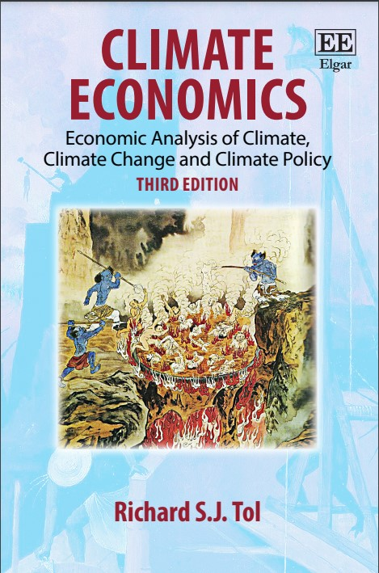

## Climate Economics
### Economic analysis of climate, climate change, and climate policy

This is the resource site for [Richard Tol's](https://www.ae-info.org/ae/Member/Tol_Richard) textbook _Climate Economics_.

The 2nd edition of the book can be ordered from [Edward Elgar](https://www.e-elgar.com/shop/gbp/climate-economics-9781786435095.html), [Amazon UK](https://www.amazon.co.uk/Climate-Economics-Economic-Analysis-Change/dp/1786435098/), [Amazon USA](https://www.amazon.com/Climate-Economics-Economic-Analysis-Change/dp/1786435098/) or any other bookstore. The third edition is due in March 2023. It can now be [pre-ordered](https://www.amazon.co.uk/Climate-Economics-Economic-Analysis-Change/dp/1802205454/).

The first edition was translated into Chinese as 氣候經濟學 – 氣候的經濟分析氣候變化和氣候政策. It is for sale on [DangDang](http://product.dangdang.com/24013529.html), [Amazon China](https://www.amazon.cn/%E6%B0%94%E5%80%99%E7%BB%8F%E6%B5%8E%E5%AD%A6-%E6%B0%94%E5%80%99-%E6%B0%94%E5%80%99%E5%8F%98%E5%8C%96%E4%B8%8E%E6%B0%94%E5%80%99%E6%94%BF%E7%AD%96%E7%BB%8F%E6%B5%8E%E5%88%86%E6%9E%90-%E7%90%86%E6%9F%A5%E5%BE%B7%E2%80%A2S-J-%E6%89%98%E5%B0%94/dp/B01KJ0SPOS/) and [Amazon USA](https://www.amazon.com/%E6%B0%94%E5%80%99%E7%BB%8F%E6%B5%8E%E5%AD%A6-%E6%B0%94%E5%80%99%E6%B0%94%E5%80%99%E5%8F%98%E5%8C%96%E4%B8%8E%E6%B0%94%E5%80%99%E6%94%BF%E7%AD%96%E7%BB%8F%E6%B5%8E%E5%88%86%E6%9E%90-%E4%BD%8E%E7%A2%B3%E6%99%BA%E5%BA%93%E8%AF%91%E4%B8%9B-J-R-R-%E6%89%98%E5%B0%94%E9%87%91/dp/7565422932).

The following resources are there for students and professors:
* [Slides](https://rtol.github.io/ClimateEconomics/slide/) for teaching and annotation
* [Videos](https://rtol.github.io/ClimateEconomics/video/) for teaching support and revision
* [Quizzes](https://rtol.github.io/ClimateEconomics/quiz/) for revision and reflection
* [MLIAM](https://rtol.github.io/ClimateEconomics/mliam/) for building and applying an integrated assessment model

Follow the author on <a rel="me" href="https://mastodon.social/@richardtol">Mastodon</a>
